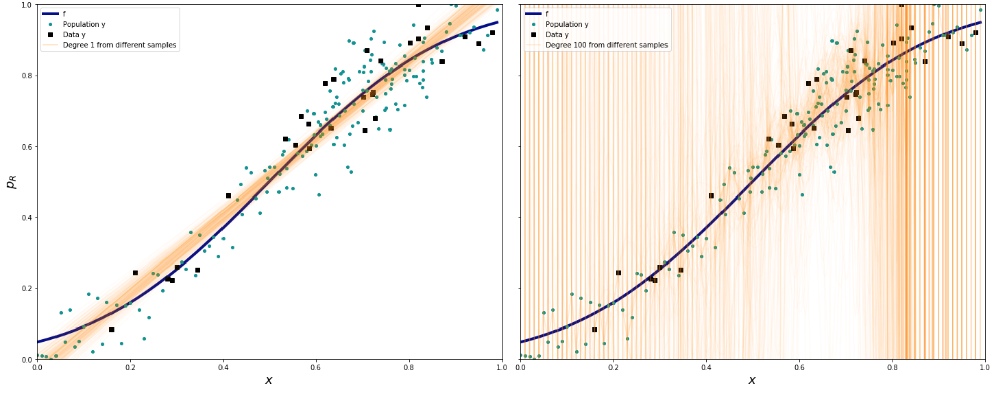

The aim of this exercise is to understand bias variance tradeoff. For this, you will fit different degree polynomial regression on the same data and plot them as given below.

## **Instructions:**

Read the file noisypopulation.csv as a pandas dataframe.

Assign the response and predictor variables appropriately.

Perform bootstrap operation on the dataset. 

For each bootstrap:

For degree of the chosen degree value:

Compute the polynomial features

Fit the model on the given data

Select a set of random points in the data to predict the model

Store the predicted values as a list

Plot the predicted values along with the random data points and true function as given above.

## **Hints:**

sklearn.PolynomialFeatures()

Generates polynomial and interaction features

sklearn.LinearRegression()

LinearRegression fits a linear model

sklearn.fit()

Fits the linear model to the training data

sklearn.predict()

Predict using the linear model.

Note: This exercise is auto-graded and you can try multiple attempts. 