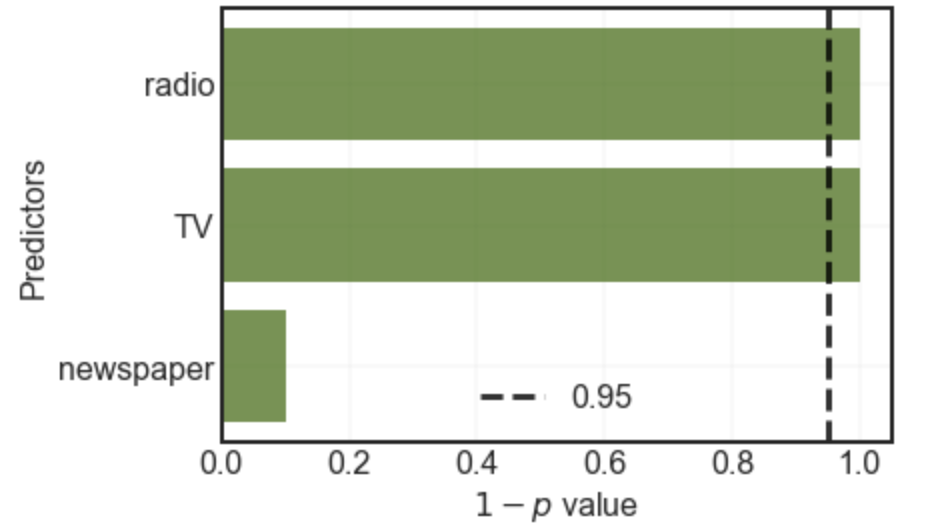

The goal of this exercise is to identify the relevant features of the dataset using Hypothesis testing and plotting a bar plot like the one below:

## **Instructions:**

Read the file Advertising.csv as a dataframe.

Fit a simple multi-linear regression with "medv" as the response variable and the remaining columns as the predictor variables.

Compute the coefficients of the model and plot a bar chart to depict these values.

To find the distributions of the coefficients perform bootstrap.

For each bootstrap:

Fit a simple multi-linear regression with the same conditions as before.

Compute the coefficient values and store as a list.

Compute the $|t|$ values for each of the coefficient value in the list.

Plot a bar chart of the varying $|t|$ values.

Compute the p-value from the $|t|$ values.

Plot a bar chart of $1-p$ values of the coefficients. Also mark the 0.95 line on the chart as shown above.

## **Hints:**

pd.read_csv(filename)

 Returns a pandas dataframe containing the data and labels from the file data

sklearn.preprocessing.normalize()

Scales input vectors individually to unit norm (vector length).

np.interp()

Returns one-dimensional linear interpolation

sklearn.train_test_split()

Splits the data into random train and test subsets

sklearn.LinearRegression()

LinearRegression fits a linear model

sklearn.fit()

Fits the linear model to the training data

sklearn.predict()

Predict using the linear model.

Note: This exercise is auto-graded and you can try multiple attempts. 