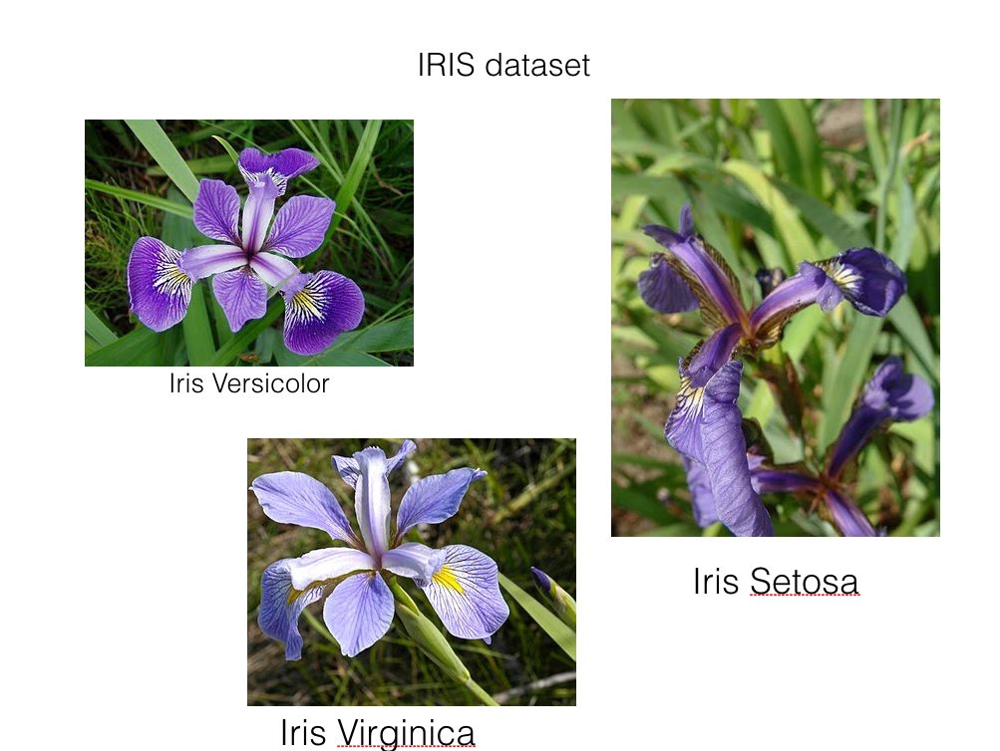
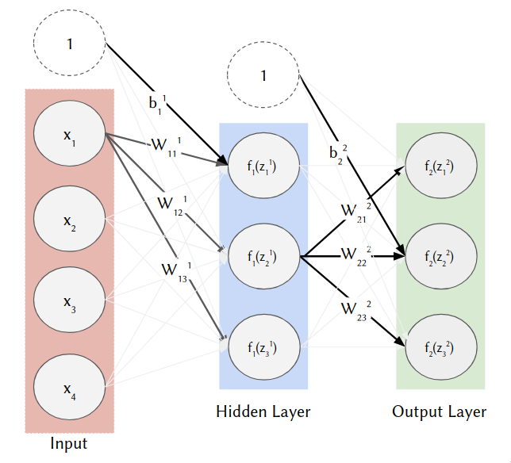

In this exercise, we will construct a neural network to classify 3 species of iris. The classification is based on 4 measurement predictor variables: sepal length & width, and petal length & width in the given dataset.

## **Instructions:**

The Neural Network will be built from scratch using pre-trained weights and biases. Hence, we will only be doing the forward (i.e., prediction) pass. 

Load the iris dataset from sklearn standard datasets.

Assign the predictor and response variables appropriately.

One hot encode the categorical labels of the predictor variable.

Load and inspect the pre-trained weights and biases.

Construct the MLP:

Augment X with a column of ones to create the augmented design matrix X 

Create the first layer weight matrix by vertically stacking the bias vector on top of the weight vector

Perform the affine transformation 

Activate the output of the affine transformation using ReLU 

Repeat the first 3 steps for the hidden layer (augment, vertical stack, affine)

Use softmax on the final layer

Finally, predict y 

## **Hints:**

This will further develop our intuition for the architecture of a deep neural network. This diagram shows the structure of our network. You may find it useful to refer to it during the exercise.

This is our first encounter with a multi-class classification problem and also the softmax activation on the output layer. Note: $f_1()$ above is the ReLU activation and $f_2()$ is the softmax.

to_categorical(y, num_classes=None, dtype='float32')

Converts a class vector (integers) to the binary class matrix.

np.vstack(tup)

Stack arrays in sequence vertically (row-wise).

numpy.dot(a, b, out=None)

Returns the dot product of two arrays.

numpy.argmax(a, axis=None, out=None)

Returns the indices of the maximum values along an axis.

Note: This exercise is auto-graded and you can try multiple attempts. 