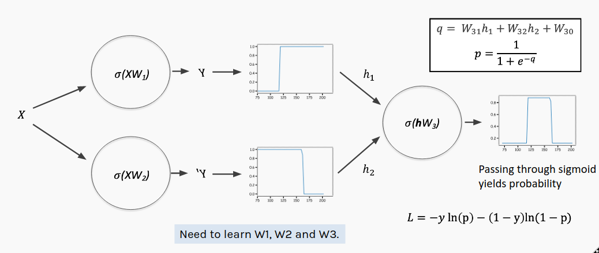

From the exercise A.1, we observe that a single neuron is rather limited in what it can accomplish. But what if we expand the number of neurons in our network to make it more expressive? 

The aim of this exercise is to construct an MLP learn its parameters from data using the Keras API which is part of Tensorflow 2.x.

TensorFlow is a framework for representing complicated DNN algorithms and executing them in any platform, from a phone to a distributed system using GPUs. Developed by Google Brain, TensorFlow is used very widely today.

Keras is a high-level API used for fast prototyping, advanced research, and production. We will use tf.keras which is TensorFlow's implementation of the Keras API.

You can learn more about Keras here.

[Note: In this image $W$ matrices include both weight and bias terms and the vector input $x$ has been augmented into the matrix $X$ by adding a column of ones]

In our example, we have a single input, $x$  

The first layer consists of 2 nodes (or neurons), each with its own weight and bias used to perform an affine transformation on the nodes' respective inputs. We refer to this as the 'hidden' layer. 

Both nodes in the hidden layer use the same activation function of the form $\sigma\left(\cdot\right)$ on their affine transformations.

The outputs of the hidden layer nodes must then be combined to give the overall output of the network. This is the output layer. Because we will interpret the output as a probability we just take a linear combination of the hidden layer and pass it through another sigmoid activation to produce the actual prediction, $y$.  Notice that the output layer has its own weights and bias.

This multilayer perceptron is much more expressive than a single perceptron, but setting all the new parameters manually would be quite tedious. And in larger networks, it's completely infeasible!

## **Instructions:**

Read the heart dataset as a pandas dataframe

Assign the predictor and response variable and plot the data.

Instantiate a Keras model

Add a hidden layer with 2 nodes and a sigmoid activation function

Add an output layer by choosing the number of nodes and the activation function

Compile the model with binary cross-entropy as the loss function

Fit the data on the model by specifying the number of epochs.

Plot the training history

Predict using the model and compute the accuracy

## **Hints:**

keras.add()

To add a layer to the model

keras.fit()

Fit the model for the data

Note: This exercise is auto-graded and you can try multiple attempts. 