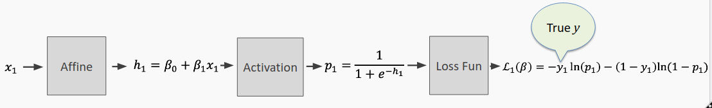
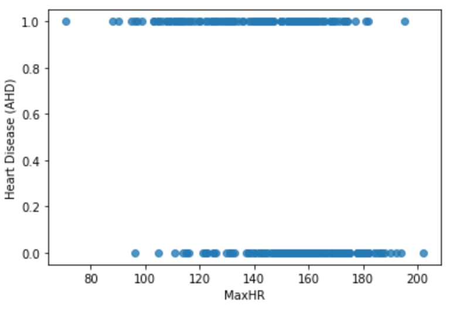
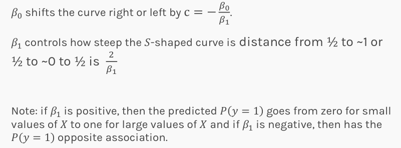
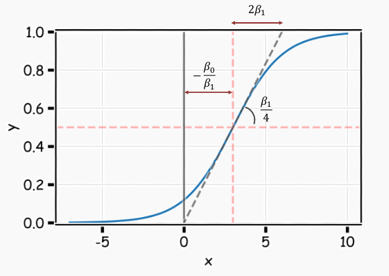

The goal of this exercise is to predict the probability of a person having heart disease given their max heart rate using a single neuron.

## **Instructions:**

Read the datafile Heart.csv as a pandas dataframe.

Use the maximum heart rate as your predictor and probability of a person having heart disease as your response variable.

Plot the data by replacing the column values i.e. 'Yes' and 'No' of the response variables with 1 and 0 respectively. The graph will look like the one given below.

Construct a perceptron. This will need 3 functions:

The first function should return an affine transformation of the data for a single neuron.  

The second function should return the sigmoid activation function. 

We'll use the previous two functions to create a predict function to output predictions from our perceptron (aka neuron).

After making predictions using the perceptron we will plot our results.

## **Hints:**

Remember you will need to tune the perceptron's parameters by hand. The following selections from the lecture may be helpful. 

(Note: $\beta_0$ and $\beta_1$ in the slides are referred to as b and w in the code)

plt.scatter()

A scatter plot of y vs. x with varying marker size and/or colour.

np.exp()

Calculates the exponential of all elements in the input array.

plt.xlabel()

This is used to specify the text to be displayed as the label for the x-axis.

plt.ylabel()

This is used to specify the text to be displayed as the label for the y-axis.

pd.replace(from, to)

Replace values given in from with to.

Note: This exercise is auto-graded and you can try multiple attempts