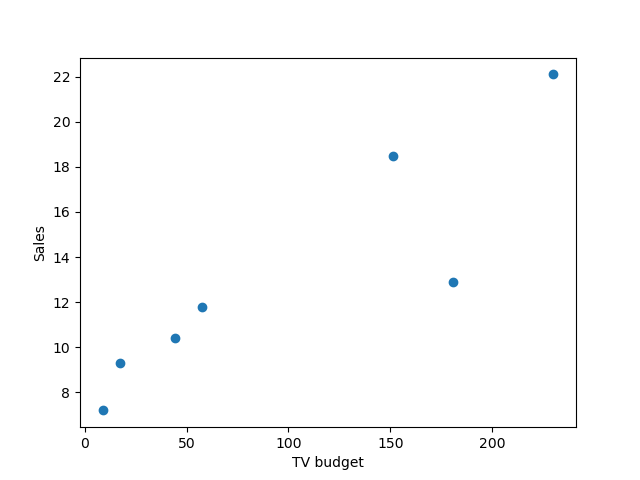

The aim of this exercise is to plot TV Ads vs Sales based on the Advertisement dataset which should look similar to the graph given below. 

## **Instructions:**

Read the Advertisement data and view the top rows of the dataframe to get an understanding of the data and columns

Select the first 7 observations and the columns TV and sales.

Create a scatter plot TV budget vs sales like in the lecture.

## **Hints:** 

pd.read_csv(filename)

 Returns a pandas dataframe containing the data and labels from the file data

df.iloc[]

Returns a subset of the dataframe that is contained in the row range passed as the argument

np.linspace()

Returns evenly spaced numbers over a specified interval

df.head()

Returns the first 5 rows of the dataframe with the column names

plt.scatter()

A scatter plot of y vs. x with varying marker size and/or colour

plt.xlabel()

This is used to specify the text to be displayed as the label for the x-axis

Note: This exercise is auto-graded and you can try multiple attempts. 