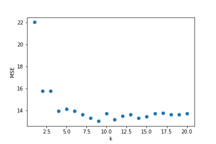

The goal here is to find the value of k of the best performing model based on the test MSE.

## **Instructions:**

Read the data into a dataframe object using pandas.read_csv

Select the sales column as the response variable and TV budget column as the predictor variable

Make a train-test split using sklearn.model_selection.train_test_split

Create a list of integer k values using numpy.linspace

For each value of k

Fit a knn regression on train set

Calculate MSE on test set and store it

Plot the test MSE values for each k

Find the k value associated with the lowest test MSE

## **Hints:** 

train_test_split(X,y)

Split arrays or matrices into random train and test subsets. 

np.linspace()

Returns evenly spaced numbers over a specified interval.

KNeighborsRegressor(n_neighbors=k_value)

Regression-based on k-nearest neighbors. 

mean_squared_error()

Computes the mean squared error regression loss.

dict.keys() 

returns a view object that displays a list of all the keys in the dictionary.

dict.values() 

 returns a list of all the values available in a given dictionary.

dict.items() 

returns a list of dict's (key, value) tuple pairs

Note: This exercise is auto-graded and you can try multiple attempts. 