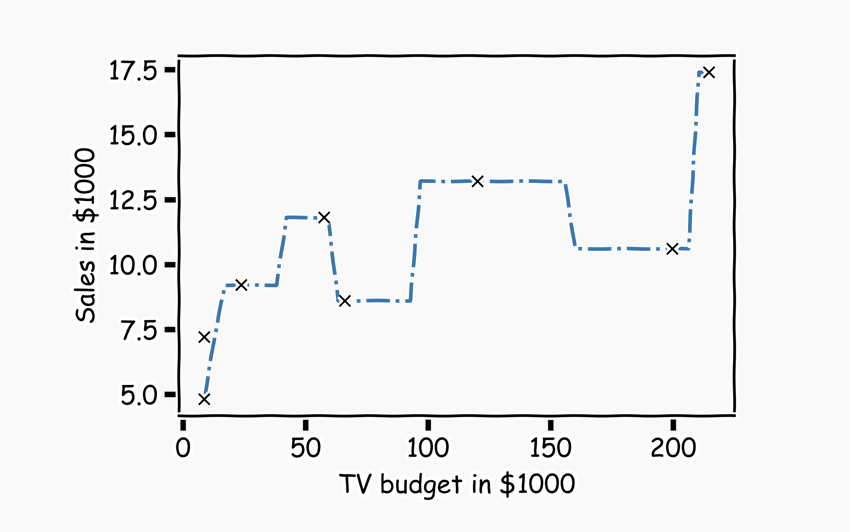
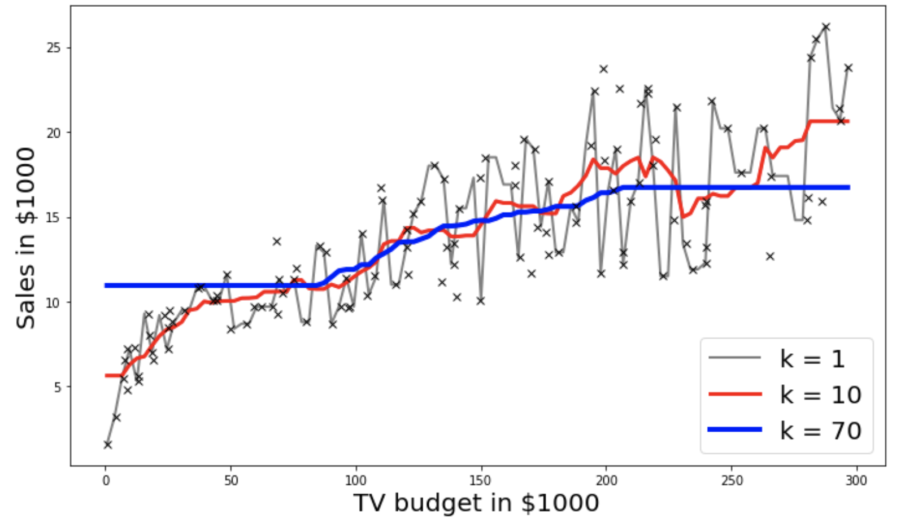

The goal of this exercise is to re-create the plots below from the lecture. 

## **Instructions:**

**Part 1 KNN by hand for k=1**

Read the Advertisement data 

Get a subset of the data from row 5 to row 13

Apply the kNN algorithm by hand and plot the first graph as given above.

**Part 2 Using sklearn package**

Read the entire Advertisement dataset

Split the data into train and test sets using train_test_split() function

Select k_list  as possible k values ranging from 1 to 70.

For each value of k in k_list:

Use sklearn KNearestNeighbors() to fit train data

Predict on the test data

Use the helper code to get the second plot above for k=1,10,70

## **Hints:** 

np.argsort()

Returns the indices that would sort an array. 

df.iloc[]

Returns a subset of the dataframe that is contained in the column range passed as the argument

df.values

Returns a Numpy representation of the DataFrame.

pd.idxmin()

Returns index of the first occurrence of minimum over requested axis.

np.min()

Returns the minimum along a given axis.

np.max()

Returns the maximum along a given axis.

np.zeros()

Returns a new array of given shape and type, filled with zeros.

train_test_split(X,y)

Split arrays or matrices into random train and test subsets. 

np.linspace()

Returns evenly spaced numbers over a specified interval.

KNeighborsRegressor(n_neighbors=k_value)

Regression-based on k-nearest neighbors. 

Note: This exercise is auto-graded and you can try multiple attempts. 