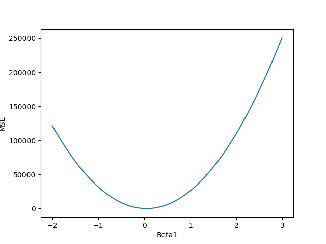

The goal here is to produce a plot like the one given below.

## **Instructions:**

  We want to find the model that fit best the data. To do so we are going to 

1) Fix $\beta_0 = 2.2$, 

2) Change $\beta_1$ in a range $[-2, 3]$, and 

3) Estimate the fit of the model. 

Create empty lists;

Set a range of values for $\beta_1$ and compute MSE for each one;

Compute MSE for varying $\beta_1$

## **Hints:**

np.linspace(start, stop, num)

Return evenly spaced numbers over a specified interval.

np.arange(start, stop, increment)

Return evenly spaced values within a given interval

list_name.append(item)

Add an item to the end of the list

plt.xlabel()

This is used to specify the text to be displayed as the label for the x-axis

plt.ylabel()

This is used to specify the text to be displayed as the label for the y-axis

Note: This exercise is auto-graded and you can try multiple attempts