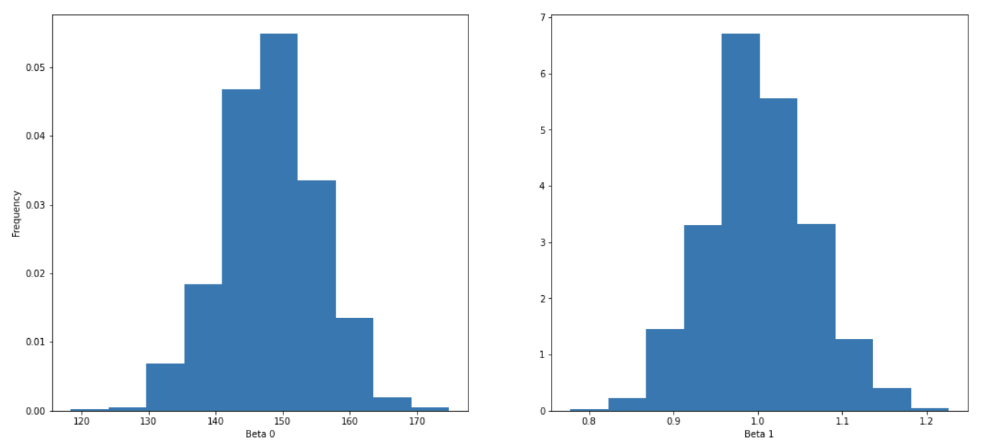

Solve the previous exercise by building your own bootstrap function.

## **Instructions**

Define a function bootstrap that takes a dataframe as the input. Use NumPy's random.randint() function to generate random integers in the range of the length of the dataset. These integers will be used as the indices to access the rows of the dataset.

Similar to the previous exercise, compute the $\beta_0$ and $\beta_1$ values for each instance of the dataframe.

Plot the $\beta_0$, $\beta_1$ histograms.

## **Hints**

To compute the beta values use the following equations:

$\beta_{0}=\bar{y}-\left(b_{1} * \bar{x}\right)$

$\beta_{1}=\frac{\sum(x-\bar{x}) *(y-\bar{y})}{\sum(x-\bar{x})^{2}}$

where $\bar{x}$ is the mean of $x$ and $\bar{y}$ is the mean of $y$

np.random.randint()

Returns list of integers as per mentioned size 

np.dot()

Computes the dot product of two arrays

df.iloc[]

Purely integer-location based indexing for selection by position

ax.hist()

Plots a histogram

ax.set_xlabel()

Sets label for x-axthe is

ax.set_ylabel()

Sets label for the y-axis

Note: This exercise is auto-graded and you can try multiple attempts. 