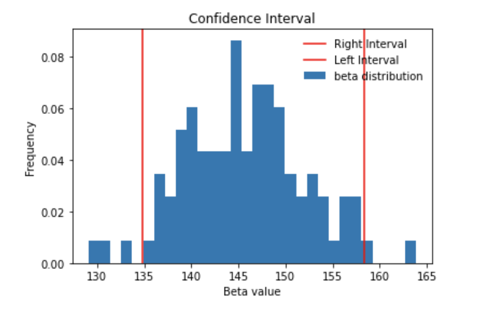

The goal of this exercise is to create a plot like the one given below for $\beta_0$ and $\beta_1$. 

## **Instructions**

Follow the steps from the previous exercise to get the lists of beta values.

Sort the list of beta values (from low to high).

To compute the 95% confidence interval, find the 2.5 percentile and the 97.5 percentile using np.percentile()

Use the helper code plot_simulation() to visualise the $\beta$ values along with its confidence interval

## **Hints**

np.random.randint()

Returns list of integers as per mentioned size 

df.iloc[]

Purely integer-location based indexing for selection by position

plt.hist()

Plots a histogram

plt.axvline()

Adds a vertical line across the axes

plt.axhline()

Add a horizontal line across the axes

plt.xlabel()

Sets the label for the x-axis

plt.ylabel()

Sets  the label for the y-axis

plt.legend()

Place a legend on the axes

ndarray.sort()

Returns the sorted ndarray.

np.percentile(list, q)

Returns the q-th percentile value based on the provided ascending list of values.

Note: This exercise is auto-graded and you can try multiple attempts. 