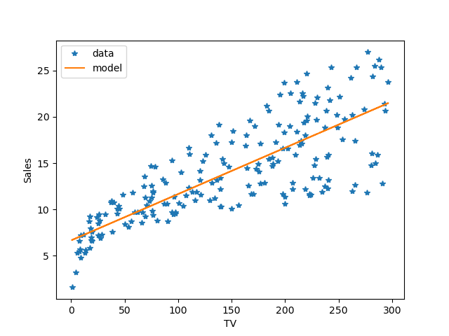

The goal of this exercise is to guess a model based on the plot below and also calculate the MSE for your guess model.

## **Instructions:**  

We are trying to predict sales as a function of the advertising budget for TV using the data.  

To do so we need 1) a model and 2) a method to estimate how good the model is. 

Guess the values of the  coefficients $\beta_0$ and $\beta_1$ by visually inspecting the graph above;

Plot your model's prediction (use the formula of a simple linear regression, no package allowed) ;

Change the values of the coefficients $\beta_0$ and $\beta_1$ to improve the fit;

Calculate the Mean Squared Error (MSE) for the model.

## **Hints:** 

Recall the formula for the linear regression model $\hat{y}= \beta_0 + \beta_1*x$

Recall the formula for Mean Squared Error $MSE =\frac{1}{n}\sum_{i=1}^{n}(y_i-\hat{y})^2$

Guess $\beta_0$ by observing the intercept of your model and $\beta_1$ looking at the slope

np.mean()

Computes the arithmetic mean along the specified axis

plt.plot()

Plots x versus y as lines and/or markers

plt.xlabel()

Sets the label for the x-axis.

plt.ylabel()

Sets the label for the y-axis.

plt.legend()

Places a legend on the axes

Note: This exercise is auto-graded and you can try multiple attempts. 