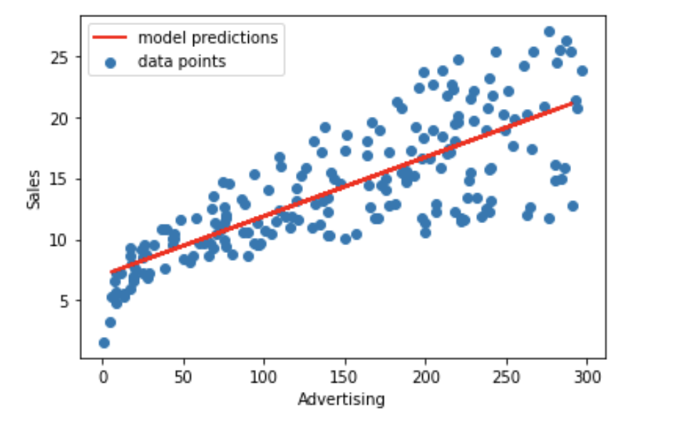

The goal here is to use the sklearn package to fit a Linear Regression on the previously used Advertising.csv and produce a plot like the one given below.

## **Instructions:**

  We want to find the model that fit best the data. To do so we are going to 

1) Use train_test_split() function to split the dataset into training and testing sets.

2) Use the LinearRegression function to make a model.

3) Fit the model on the training set

4) Predict on the testing set using the fit model.

5) Estimate the fit of the model using mean_squared_error function

6) Plot the dataset along with the predictions to visualize the fit

## **Hints:**

pd.read_csv(filename)

 Returns a pandas dataframe containing the data and labels from the file data

sklearn.train_test_split()

Splits the data into random train and test subsets

sklearn.LinearRegression()

LinearRegression fits a linear model

sklearn.fit()

Fits the linear model to the training data

sklearn.predict()

Predict using the linear model.

Note: This exercise is auto-graded and you can try multiple attempts