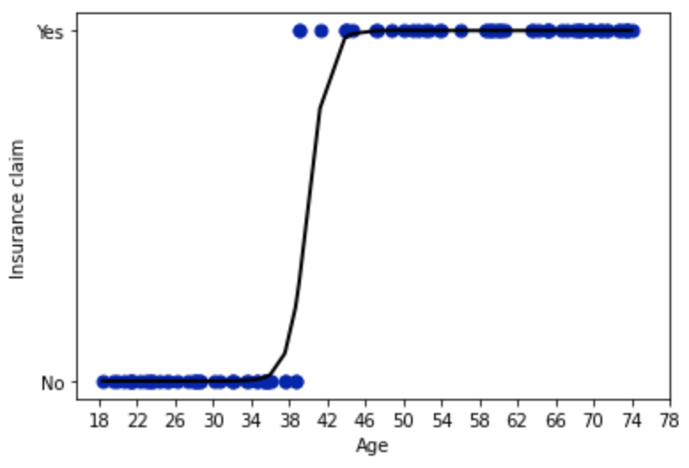

The goal of the exercise is to produce a plot similar to the one given below, by guesstimating the values of the coefficients β0 and β1.

## **Instructions:** 

We are trying to predict who will claim insurance as a function of age using the data. To do so we need :

Read the `insurance_claim.csv` as a dataframe.

Assign the predictor and response variables.

Guesstimate the values of the coefficients β0 and β1.

Predict the response variable using the formula of a simple logistic regression given below (no package allowed) 

Compute the accuracy of the model.

Repeat the above steps by changing the values of the coefficients β0 and β1, until you get "good" accuracy.

Plot the Age vs Insurance Claim graph with the fit of the model.

## **Hints:** 

Logistic Regression equation: 

p\left(y=1\right)\ =\ \frac{1}{1+e^{-\left(\beta_0+\beta_1x\ +\ \beta_2x^2+\ ...\ \beta_nx^n\right)}}

plt.plot()

Plots x versus y as lines and/or markers

sklearn.accuracy_score()

Accuracy classification score

plt.xticks()

Get or set the current tick locations and labels of the x-axis.

plt.yticks()

Get or set the current tick locations and labels of the y-axis.

plt.xlabel()

Set the label for the x-axis.

plt.ylabel()

Set the label for the y-axis.

Note: This exercise is auto-graded and you can try multiple attempts. 