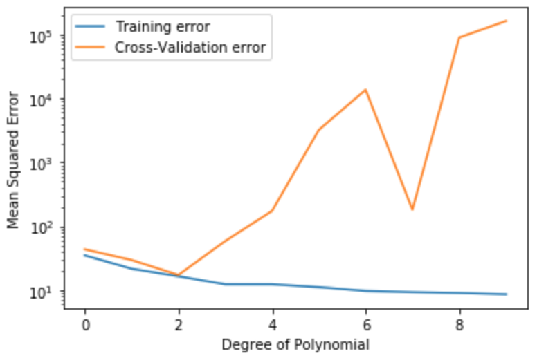

The aim of this exercise is to find the best degree of polynomial based on the MSE values. Further, plot the train and cross-validation error graphs as shown below.

## **Instructions:**

Read the dataset and split into train and validation sets

Select a max degree value for the polynomial model

For each degree:

Perform k-fold cross validation

Fit a polynomial regression model for each degree to the training data and predict on the validation data

Compute the train, validation and cross-validation error as MSE values and store in separate lists.

Print the best degree of the model for both validation and cross-validation approaches.

Plot the train and cross-validation errors for each degree.

## **Hints:**

pd.read_csv(filename)

 Returns a pandas dataframe containing the data and labels from the file data

sklearn.train_test_split()

Splits the data into random train and test subsets

sklearn.PolynomialFeatures()

Generates a new feature matrix consisting of all polynomial combinations of the features with degree less than or equal to the specified degree

sklearn.cross_validate()

Evaluate metric(s) by cross-validation and also record fit/score times.

sklearn.fit_transform()

Fits transformer to X and y with optional parameters fit_params and returns a transformed version of X

sklearn.LinearRegression()

LinearRegression fits a linear model

sklearn.fit()

Fits the linear model to the training data

sklearn.predict()

Predict using the linear model.

plt.subplots()

Create a figure and a set of subplots

operator.itemgetter()

Return a callable object that fetches item from its operand

zip()

Makes an iterator that aggregates elements from each of the iterables.

Note: This exercise is auto-graded and you can try multiple attempts. 