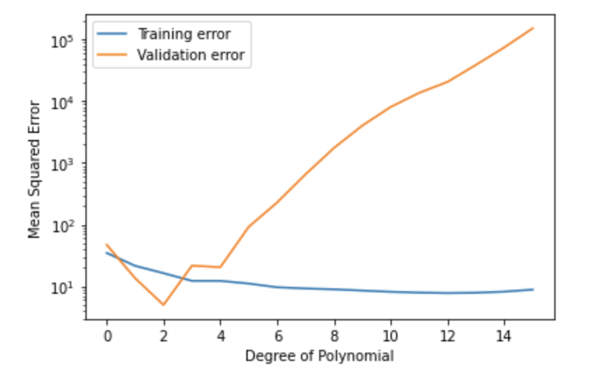

The aim of this exercise is to find the best degree of polynomial based on the MSE values. Further, plot the train and validation error graphs as shown below.

## **Instructions:**

Read the dataset and split into train and validation sets

Select a max degree value for the polynomial model

Fit a polynomial regression model for each degree to the training data and predict on the validation data

Compute the train and validation error as MSE values and store in separate lists.

Find out the best degree of the model.

Plot the train and validation errors for each degree.

## **Hints:**

pd.read_csv(filename)

 Returns a pandas dataframe containing the data and labels from the file data

sklearn.train_test_split()

Splits the data into random train and test subsets

sklearn.PolynomialFeatures()

Generates a new feature matrix consisting of all polynomial combinations of the features with degree less than or equal to the specified degree

sklearn.fit_transform()

Fits transformer to X and y with optional parameters fit_params and returns a transformed version of X

sklearn.LinearRegression()

LinearRegression fits a linear model

sklearn.fit()

Fits the linear model to the training data

sklearn.predict()

Predict using the linear model.

plt.subplots()

Create a figure and a set of subplots

operator.itemgetter()

Return a callable object that fetches item from its operand

zip()

Makes an iterator that aggregates elements from each of the iterables.

Note: This exercise is auto-graded and you can try multiple attempts. 