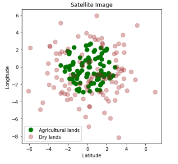

The aim of this exercise is to fit a multi polynomial regression curve on the data and then plot a decision boundary around this data such that the division between the classes is clearly visible.

A Decision Boundary is a curve margin that separates different classes. 

Dataset Description

The data used in this exercise gives a geographic location (latitude and longitude) of agricultural lands and drylands.

## **Instructions:**

Read the dataset land_type.csv

Plot the data class-wise to understand the dataset better.

Fit a multi-polynomial logistic regression model

Plot the decision boundary for the data

## **Hints:**

np.meshgrid 

Return coordinate matrices from coordinate vectors.

plt.contour()

Plot contours

plt.subplots()

Create a figure and a set of subplots.

ax.plot()

Plot y versus x as lines and/or markers

ax.set_xlabel()

Sets label for the x-axis

ax.set_ylabel()

Sets label for the y-axis

ax.scatter()

A scatter plot of y vs. x with varying marker size and/or color.

np.arange()

Return evenly spaced values within a given interval.

np.random.multivariate_normal

Draw random samples from a multivariate normal distribution.

np.concatenate

Join a sequence of arrays along an existing axis.

sklearn.PolynomialFeatures()

Generates a new feature matrix consisting of all polynomial combinations of the features with degree less than or equal to the specified degree

sklearn.fit_transform()

Fits transformer to X and y with optional parameters fit_params and returns a transformed version of X

sklearn.fit()

Fits the linear model to the training data

sklearn.predict()

Predict using the linear modReturns the coefficient of the predictors in the model.

ax.contourf()

Plot contours

sklearn.LogisticRegression()

Generates a Logistic Regression classifier

np.hstack

Stack arrays in sequence horizontally (column-wise).

Note: This exercise is auto-graded and you can try multiple attempts. 