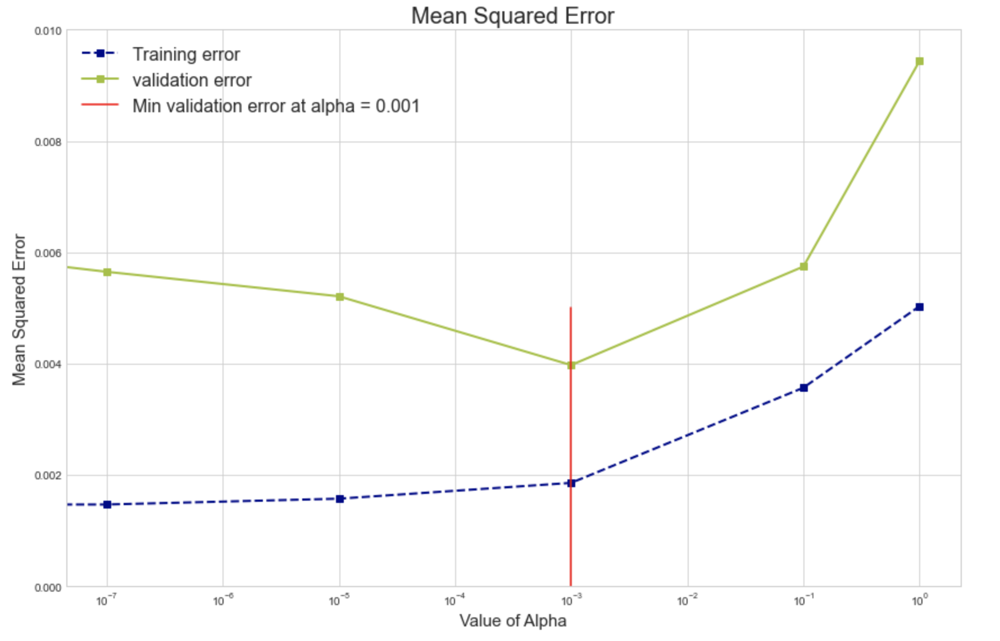

The goal of this exercise is to perform hyper-parameter tuning and produce a plot similar to the one below:

## **Instructions**

Read the dataset "polynomial50.csv" as a dataframe.

Assign the predictor and response variables.

Visualize the dataset by making plots using the predictor and response variables along with the true function.

Split the data into train and validation sets using random_state=42.

For each value of alpha from a given list:

Estimate a Ridge regression on the training data with the alpha value.

Calculate the MSE of training and validation data. Append to separate lists appropriately.

Use the given plot_functions function to plot the value of parameters.

Compute the best hyperparameter for this data based on the lowest MSE

Make a plot of the MSE values for each value of hyper-parameter alpha from the list above. It should look similar to the one given above.

Dataset Description:

The dataset has a total of 3 columns with names - x,y and f

"$x$" represents the predictor variable

"$y$" is the response variable

"$f$" denotes the true values of the underlying function

## **Hints**

sklearn.Ridge()

Linear least squares with L2 regularization

sklearn.train_test_split()

Splits the data into random train and test subsets

ax.plot()

Plot y versus x as lines and/or markers

sklearn.PolynomialFeatures()

Generates a new feature matrix consisting of all polynomial combinations of the features with degree less than or equal to the specified degree

sklearn.fit_transform()

Fits transformer to X and y with optional parameters fit_params and returns a transformed version of X

sklearn.Ridge()

Linear least squares with L2 regularization

sklearn.predict()

Predict using the linear modReturns the coefficient of the predictors in the model.

mean_squared_error()

Mean squared error regression loss

Note: This exercise is auto-graded and you can try multiple attempts. 