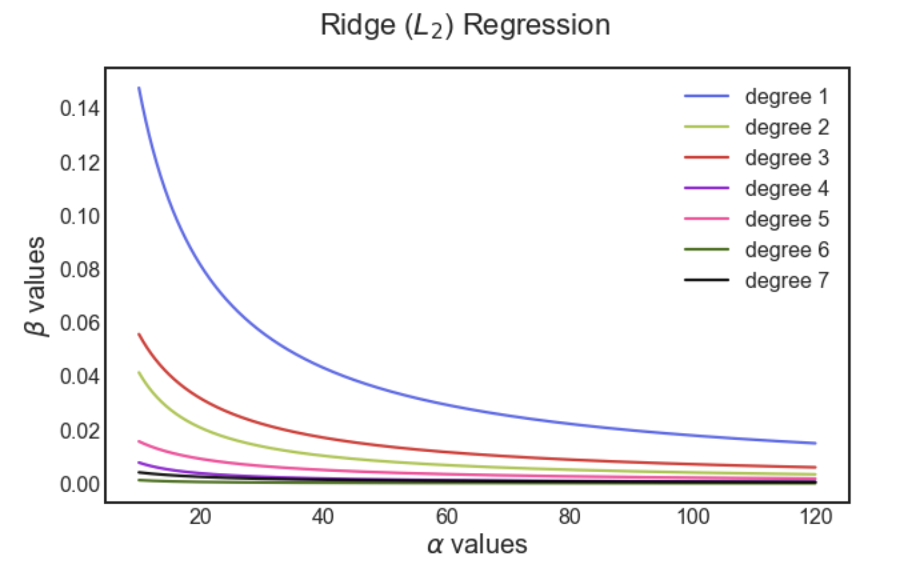

The goal of this exercise is to understand the variation of the coefficients of the predictors with varying values of regularization parameter in Lasso and Ridge regularization.

Below is a sample plot for Ridge ($L_2$ regularization)

## **Instructions:**

Read the dataset bateria_train.csv and assign the predictor and response variables.

The predictor is the 'Spreading factor' and the response variable is the 'Perc_population'

Use a maximum degree of 4 to make polynomial features and make a new predictor x_poly

Make a list of alpha values.

For each value of $\alpha$:

Fit a multi-linear regression using $L_2$ regularization

Compute the coefficient of the predictors and store to the plot later

Make a plot of the coefficients along with the alpha values

Make a new alpha list as per the code in the exercise

Implement Lasso regularization by repeating the above steps for each value of alpha

make another plot of the coefficients along with the new alpha values

## **Hints:**

np.transpose()

Reverse or permute the axes of an array; returns the modified array

sklearn.normalize() 

Scales input vectors individually to the unit norm (vector length)

sklearn.PolynomialFeatures()

Generates a new feature matrix consisting of all polynomial combinations of the features with degree less than or equal to the specified degree

sklearn.fit_transform()

Fits transformer to X and y with optional parameters fit_params and returns a transformed version of X

sklearn.fit()

Fits the linear model to the training data

sklearn.predict()

Predict using the linear modReturns the coefficient of the predictors in the model.

mean_squared_error()

Mean squared error regression loss

sklearn.coef_

Returns the coefficients of the predictors

plt.subplots()

Create a figure and a set of subplots

ax.barh()

Make a horizontal bar plot

ax.set_xlim()

Sets the x-axis view limits

sklearn.Lasso()

Linear Model trained with L1 prior as a regularizer

sklearn.Ridge()

Linear least squares with L2 regularization

Note: This exercise is auto-graded and you can try multiple attempts. 