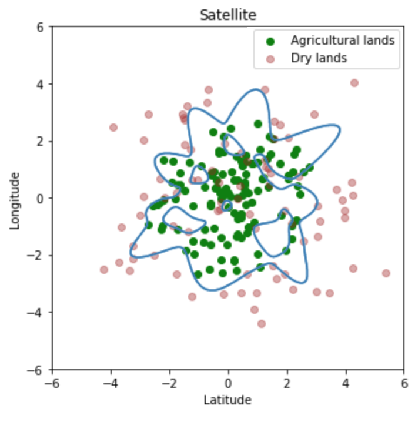

It is clear from the decision boundary in the graph shown below that the output of the previous exercise was overfitted. The aim of this exercise is to perform regularisation to reduce overfitting and further, understand the relationship between the degree and C values of the model.

## **Instructions:**

Read the dataset land_type.csv

For the given degree, choose 6 C values to perform regularisation.

Using the helper code, visualise your results 

Now select a range of degree values to compute polynomial features. Also, choose 6 C values.

For each degree:

Run a loop over all the C values

Fit a polynomial logistic regression model

Compute the best C value for that degree

Save the degree and C value in a dictionary

Use the dictionary to plot a graph of degree vs C value to understand the relation between them.

## **Hints:**

Take a closer look at the sklearn logistic regression function for performing regularisation.

Altering the degree of the polynomial features may alleviate overfitting.

np.meshgrid 

Return coordinate matrices from coordinate vectors.

plt.contour()

Plot contours

plt.subplots()

Create a figure and a set of subplots.

ax.plot()

Plot y versus x as lines and/or markers

ax.set_xlabel()

Sets label for the x-axis

ax.set_ylabel()

Sets label for the y-axis

ax.scatter()

A scatter plot of y vs. x with varying marker size and/or colour.

np.arange()

Return evenly spaced values within a given interval.

np.random.multivariate_normal

Draw random samples from a multivariate normal distribution.

np.concatenate

Join a sequence of arrays along an existing axis.

sklearn.PolynomialFeatures()

Generates a new feature matrix consisting of all polynomial combinations of the features with degree less than or equal to the specified degree

sklearn.fit_transform()

Fits transformer to X and y with optional parameters fit_params and returns a transformed version of X

sklearn.fit()

Fits the linear model to the training data

sklearn.predict()

Predict using the linear modReturns the coefficient of the predictors in the model.

ax.contourf()

Plot contours

sklearn.LogisticRegression()

Generates a Logistic Regression classifier

np.hstack

Stack arrays in sequence horizontally (column-wise).

Note: This exercise is auto-graded and you can try multiple attempts. 