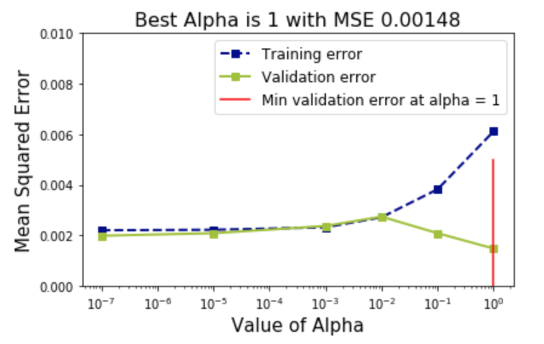

The aim of this exercise is to understand regularization with cross-validation.

## **Instructions:**

Initialising the required parameters for this exercise. This can be viewed in the scaffold.

Read the data file polynomial50.csv and assign the predictor and response variables.

Use the helper code to visualise the data.

Define a function reg_with_validation that performs Ridge regularization by taking a random_state parameter.

Split the data into train and validation sets by specifying the random_state.

Compute the polynomial features for the train and validation sets.

Run a loop for the alpha values. Within the loop:

Initialise the Ridge regression model with the specified alpha.

Fit the model on the training data and predict and on the train and validation set.

Compute the MSE of the train and validation prediction.

Store these values in lists.

Run reg_with_validation for varying random states and plot a graph that depicts the best alpha value and the best MSE. The graph will be similar to the one given above.

Define a function reg_with_cross_validation that performs Ridge regularization with cross-validation by taking a random_state parameter.

Sample the data using the specified random state.

Assign the predictor and response variables using the sampled data.

Run a loop for the alpha values. Within the loop:

Initialise the Ridge regression model with the specified alpha.

Fit the model on the entire data and using cross-validation with 5 folds.

Get the train and validation MSEs by taking their mean.

Store these values in lists.

Run reg_with_cross_validation for varying random states and plot a graph that depicts the best alpha value and the best MSE.

Use the helper code given to print your best MSEs in the case of simple validation and cross-validation for different random states.

## **Hints:**

df.sample()

Returns a random sample of items from an axis of the object.

sklearn.cross_validate()

Evaluate metric(s`by cross-validation and also record fit/score times.

np.mean()

Compute the arithmetic mean along the specified axis.

sklearn.RidgeRegression()

Linear least squares with l2 regularization.

sklearn.fit()

Fit Ridge egression model.

sklearn.predict()

Predict using the linear model.

sklearn.mean_squared_error()

Mean squared error regression loss

sklearn.PolynomialFeatures()

Generate polynomial and interaction features.

sklearn.fit_transform()

Fit to data, then transform it.