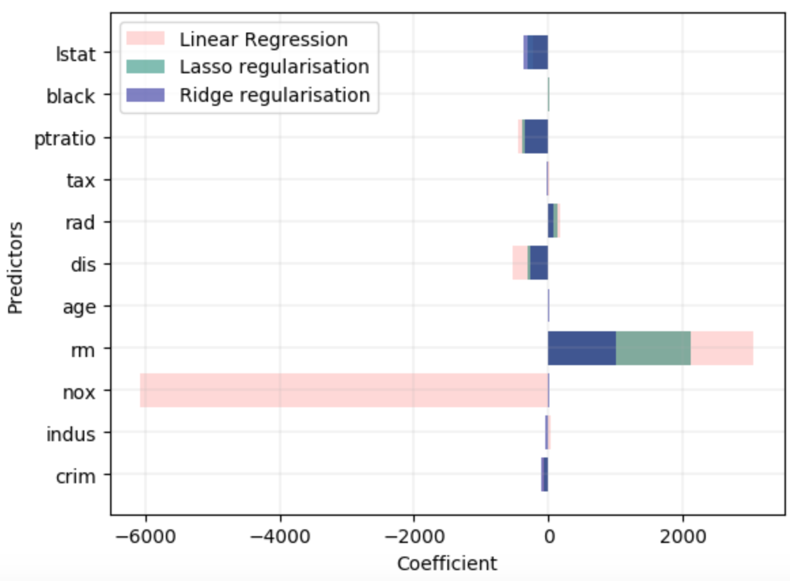

The aim of this exercise is to understand Lasso and Ridge regularization.

Plot Predictor vs Coefficient as a horizontal bar chart. The graph may look similar to the one given below.

## **Instructions:**

Read the dataset and assign the predictor and response variables.

Split the dataset into train and validation sets

Fit a multi-linear regression model

Compute the validation MSE of the model

Compute the coefficient of the predictors and store to the plot later

Implement Lasso regularization by specifying an alpha value. Repeat steps 4 and 5

Implement Ridge regularization by specifying the same alpha value. Repeat steps 4 and 5

Plot the coefficient of all the 3 models in one graph as shown above

## **Hints:**

np.transpose()

Reverse or permute the axes of an array; returns the modified array

sklearn.normalize() 

Scales input vectors individually to the unit norm (vector length)

sklearn.train_test_split()

Splits the data into random train and test subsets

sklearn.PolynomialFeatures()

Generates a new feature matrix consisting of all polynomial combinations of the features with degree less than or equal to the specified degree

sklearn.fit_transform()

Fits transformer to X and y with optional parameters fit_params and returns a transformed version of X

sklearn.LinearRegression()

LinearRegression fits a linear model

sklearn.fit()

Fits the linear model to the training data

sklearn.predict()

Predict using the linear modReturns the coefficient of the predictors in the model.

mean_squared_error()

Mean squared error regression loss

sklearn.coef_

Returns the coefficients of the predictors

plt.subplots()

Create a figure and a set of subplots

ax.barh()

Make a horizontal bar plot

ax.set_xlim()

Sets the x-axis view limits

sklearn.Lasso()

Linear Model trained with L1 prior as a regularizer

sklearn.Ridge()

Linear least squares with L2 regularization

zip()

Makes an iterator that aggregates elements from each of the iterables.

Note: This exercise is auto-graded and you can try multiple attempts. 